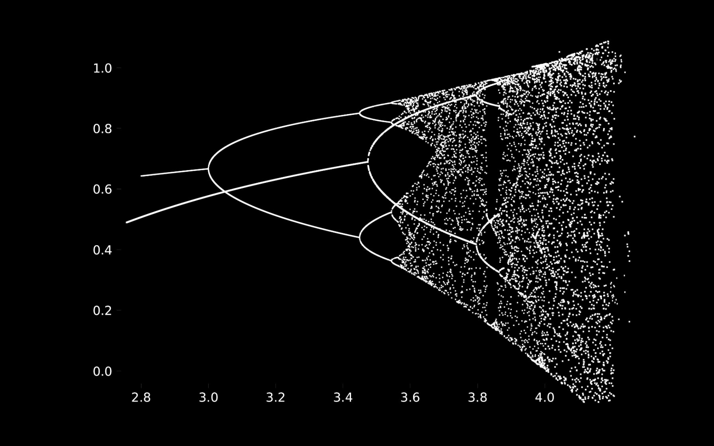

# OMNIABASE

[](https://doi.org/10.5281/zenodo.19603445)


OMNIABASE is a multirepresentational framework for structural analysis.

It does not replace existing knowledge.  
It tests whether a single representation is structurally sufficient.

Its function is simple:

- expose what remains stable across representations
- expose what emerges only under recoding
- expose what collapses when representational privilege is removed

**Author:** Massimiliano Brighindi  
**Contact:** brighissimo@gmail.com

---

## What this page shows

The opening panel condenses the practical claim of the framework:

- hidden-variable detection improves under multirepresentational analysis
- deterministic chaos becomes easier to separate from stochastic noise
- structural integrity remains more stable under perturbation
- bounded structural profiles can be computed across views
- cross-domain translation can retain measurable residue

OMNIABASE is not presented here as a slogan.  
It is presented as a framework for testing whether one view was enough.

---

## Immediate Visual Overview


A single representation can look stable and still hide structure.

OMNIABASE becomes useful when changing representation reveals:

- hidden invariance
- hidden divergence
- latent coordinates
- structural fragility
- collapse under recoding
- compatibility or incompatibility across descriptions

---

## One Concrete Example



A classical reading says:

- this system undergoes a familiar bifurcation and then enters a chaotic regime

That reading is not wrong.  
But it is still a single representation.

OMNIABASE asks a stricter question:

- what changes when the same trajectory is recoded across multiple representations instead of being observed only in the standard plot?

Possible outcomes include:

- earlier structural separation between regimes
- weak multibase signatures invisible in the ordinary view
- hidden descriptive axes compressed into one surface picture
- measurable differences between trajectories that look locally similar in one frame

For the branch most directly related to this direction, see:  
**[omniabase-coordinate-discovery](https://github.com/Tuttotorna/omniabase-coordinate-discovery)**

---

## Start Here

If you want the shortest entry into the framework, start with:

- [PROOF_PATH.md](./PROOF_PATH.md)
- [FIRST_PROOF.md](./docs/FIRST_PROOF.md)
- [FIRST_PUBLIC_DEMONSTRATION.md](./docs/FIRST_PUBLIC_DEMONSTRATION.md)

These are the shortest public access points to the project.

---

## Canonical Demonstrations

For the main public demonstrations, read:

- [OMNIABASE_PUBLIC_DEMONSTRATION.md](./docs/OMNIABASE_PUBLIC_DEMONSTRATION.md)
- [OMNIABASE_CANONICAL_DEMONSTRATION_v1.md](./docs/OMNIABASE_CANONICAL_DEMONSTRATION_v1.md)

Their purpose is not to deny the standard view.

Their purpose is stricter:

**to show that a standard view can remain correct while still being structurally incomplete.**

---

## Operational Layer

OMNIABASE is not only conceptual.

Its first operational layer is already present in the repository:

- [OMNIABASE_MRT_v0.md](./OMNIABASE_MRT_v0.md)
- [OMNIABASE_MRT_v0_CASE_01.md](./OMNIABASE_MRT_v0_CASE_01.md)
- [minimal_structural_reliability_demo_v0.md](./examples/minimal_structural_reliability_demo_v0.md)

These files define:

- the minimal reality test of the framework
- the first compiled case where OMNIABASE is used procedurally
- the first minimal example layer currently exposed in the repository

---

## Core Claim

The central claim of OMNIABASE is narrow:

**a single representation can be valid and still be structurally incomplete.**

This is not a claim that all representations are equivalent.

It is a claim that varying representation can reveal structural properties that single-view analysis systematically misses.

---

## Structural Principle

```text
object
-> multiple representations
-> alignment
-> comparison
-> structural signal

The framework is unified not by subject matter, but by the possibility of structural comparison across representations.


---

What OMNIABASE Is

OMNIABASE is a general framework for extracting, testing, and comparing structure across multiple representations.

It studies:

representation-resistant structure

representation-dependent structure

structural emergence under recoding

hidden coordinates

cross-representation compatibility

structural fragility under representational change


---

What OMNIABASE Is Not

OMNIABASE is not:

a semantic oracle

a decision engine

a universal theory of everything

a replacement for domain-specific models

a claim that every description is equally good


Its scope is narrower and stronger:

it tests whether one representation was structurally enough.


---

Foundational Separation

OMNIABASE requires a strict separation between:

measurement

interpretation

decision


Measurement asks:

what remains stable, emerges, diverges, or collapses across representations?


Interpretation asks:

what does this mean inside a theory, model, or domain?


Decision asks:

what action should follow?


These layers must not be collapsed.

This separation is non-negotiable.


---

The Three Canonical Families

1. Diagnostics

This branch studies whether observed structure remains stable beyond a single representation.

Typical outputs:

robustness scores

fragility signals

divergence indicators

instability alerts

post-hoc gates

escalation triggers


Central question:

When something looks stable in one representation, does that stability survive when representation changes?

2. Coordinate Discovery

This branch uses multiple representations to expose hidden axes, latent variables, regime separations, and structural coordinates that standard views compress or hide.

Typical outputs:

new descriptive coordinates

structural maps

latent variables

regime separations

axes useful for modeling and forecasting


Central question:

What structure becomes visible only when a phenomenon is observed across multiple codings rather than a single one?

3. Cross-Representation Translation

This branch studies compatibility and shared structural residue across different descriptions of the same object.

Typical outputs:

compatibility scores

alignment measures

translatability maps

incompatibility signals

shared structural residues


Central question:

When two descriptions appear different, how much are they still describing the same structural object?


---

Ecosystem Repositories

The public ecosystem is organized as distinct roles inside one larger architecture.

Foundation Layer

OMNIABASE

observer-suspension

MATHEMATICS-WITHOUT-REPRESENTATION

MetaBase-AdaptiveLogic

MetaBase-MBX01

Omniabase-MBX01


Measurement Layer

OMNIA

lon-mirror

Pre-Deployment-Structural-Gate

omnia-limit

OMNIA-RADAR


Representation and Translation

omniabase-coordinate-discovery

omega-translator

omega-latent-carrier

omega-method

ottavia-base8-mb01


Cognitive and Interface Layer

dual-echo-perception

reason-bridge

HASC-Human-AI-Structural-Compatibility-Protocol

omega-eden-perception

omnia-human-trajectory


Validation and Public Claim Layer

omnia-gsm8k-claim


These repositories should be read as differentiated roles, not as isolated fragments.


---

Public Proof Path

The ecosystem should be read as a chain, not as a pile of repositories.

Shortest public proof path:

observer-suspension
-> OMNIABASE
-> OMNIA
-> lon-mirror
-> Pre-Deployment-Structural-Gate
-> omnia-limit

Functional reading:

frame reduction
-> multirepresentational principle
-> structural measurement
-> runtime evidence
-> deployment gate
-> formal stop boundary

For the full version, see PROOF_PATH.md.


---

Reading Order

A newcomer can read the ecosystem in this order:

1. PROOF_PATH.md


2. FIRST_PROOF.md


3. FIRST_PUBLIC_DEMONSTRATION.md


4. OMNIABASE_PUBLIC_DEMONSTRATION.md


5. OMNIABASE_CANONICAL_DEMONSTRATION_v1.md


6. OMNIABASE_MRT_v0.md


7. OMNIABASE_MRT_v0_CASE_01.md


8. minimal_structural_reliability_demo_v0.md


9. ARCHITECTURE.md


10. BRANCHES.md


11. FOUNDATIONS.md


12. LEXICON.md


13. PHILOSOPHY.md


14. REPOSITORY_MAP.md


15. ROADMAP.md


16. CONTRIBUTING_PRINCIPLES.md


---

Repository Structure

This repository is the umbrella repository of the OMNIABASE framework.

Its purpose is to host:

the foundational principle

the common architecture

the branch taxonomy

the shared language of the framework

the proof path

the first public proof layer

the canonical public demonstrations

the minimal operational MRT layer

links to specialized branch repositories


This repository defines the framework itself, not any single branch-specific production implementation.


---

Scope

OMNIABASE applies wherever a phenomenon can be rendered into multiple workable codings, encodings, projections, or descriptive views.

This may include:

dynamical systems

symbolic sequences

model outputs

sensor streams

mathematical objects

formal descriptions

multimodal correspondences

human-AI structural interfaces


The framework is unified not by subject matter, but by the possibility of structural comparison across representations.


---

Boundary

OMNIABASE does not interpret pure meaning.
It does not decide.

It operates on structural traces, not on metaphysical guarantees.

Its boundary is what keeps the framework coherent.


---

Summary

OMNIABASE is a framework for testing structural completeness across multiple representations.

It is built on one principle:

a phenomenon is not exhausted by one view.

By changing representation, OMNIABASE aims to distinguish:

representation-dependent structure

representation-resistant structure

emergent cross-view structure

structural collapse under representational change


